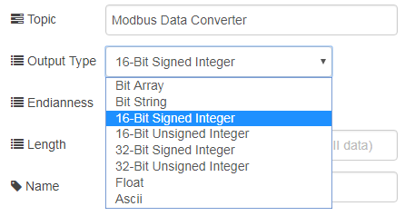
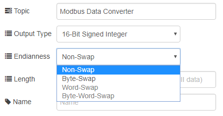
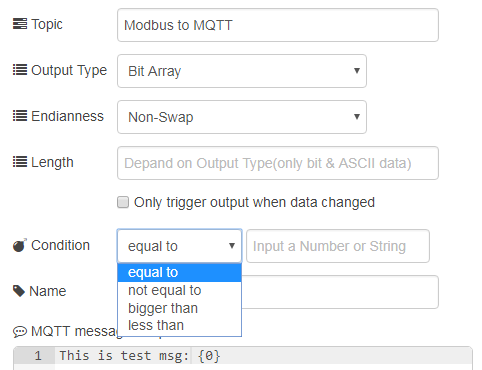
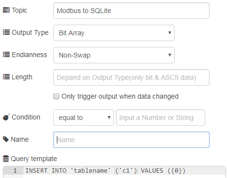

# node-red-contrib-mdbconverter
A collection of [Node-RED](http://nodered.org) nodes for ADVANTECH IIoT modbus converter to Readable data, SQLite and mqtt.

Notice that an Advantech IIoT Platform SDK have to be installed to make this node works correctly.
Advantech IIoT Platform SDK download link is shown below:
https://github.com/Advantech-IIoT/Platform-SDK/tree/master/bin

## Installation
Use npm command to install this package locally in the Node-RED modules directory
```bash
npm install node-red-contrib-mdbconverter
```
or install it globally with the command
```bash
npm install node-red-contrib-mdbconverter -g
```

## Description
You can use [node-red-contrib-modbus](https://github.com/biancode/node-red-contrib-modbus) to get modbus data and make data converter after linking to [node-red-contrib-mdbconverter](./#) nodes.

## Example
You can try demo flow  [(demo.json)](./demo.json) via import function from Node-RED editor.

There are 3 nodes in the package [modbus-data-converter], [modbus-converter2mqtt] and [modbus-converter2sqlite].

- - -

[**modbus-data-converter**]

Convert From Modbus low-data to readable data type(string, integer, float)

Here is sample flow


you can edit the properties of the node via double click.

#### Output Type 


#### Endianness


The readable data depend on the properties setting.

[**modbus-converter2mqtt**]

Convert From Modbus low-data to mqtt out node.

Here is sample flow


You also need to set Output Type and Endianness.



If you want "Only trigger output when data changed", JUST check the checkbox.

The Condition is compare with the first item of modbus low data. When Condition is satisfied, the output will also be sent out. If you dont have Condition, JUST empty the field.

MQTT message template is the message you want to publish to MQTT broker.
you can use {0} represents the first item, {1} represents the secend ...etc.

[**modbus-converter2sqlite**]

Convert From Modbus low-data to SQLite(sqlite) node.

Here is sample flow


There is a different on **modbus-converter2sqlite**.



Query template is the query you want to run on sqlite file.
you can use {0} represents the first item, {1} represents the secend ...etc.

---
## Tested Platform 
- Windows 10 Enterprise LTSB with node.js 6.10.1

## History
- 1.1.14 - October 2017 : Initial Release

## License
Copyright 2017 ADVANTECH Corp. under [the Apache 2.0 license](LICENSE).
